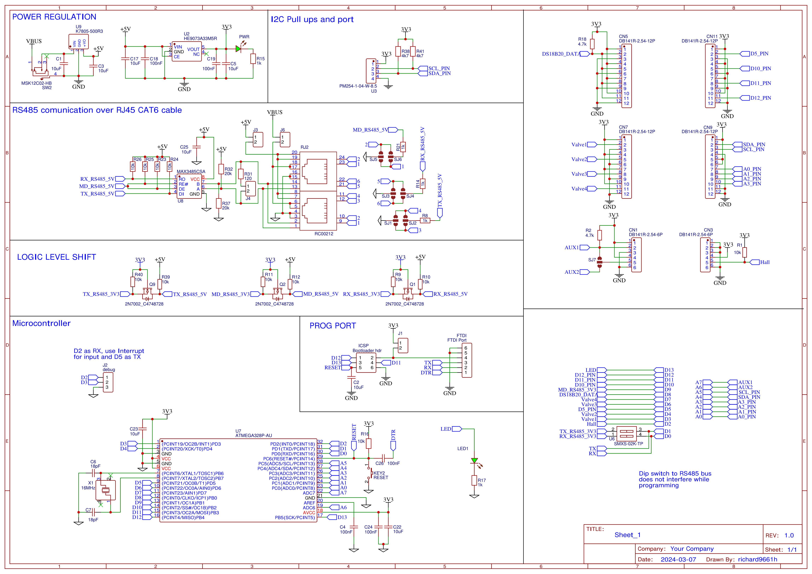
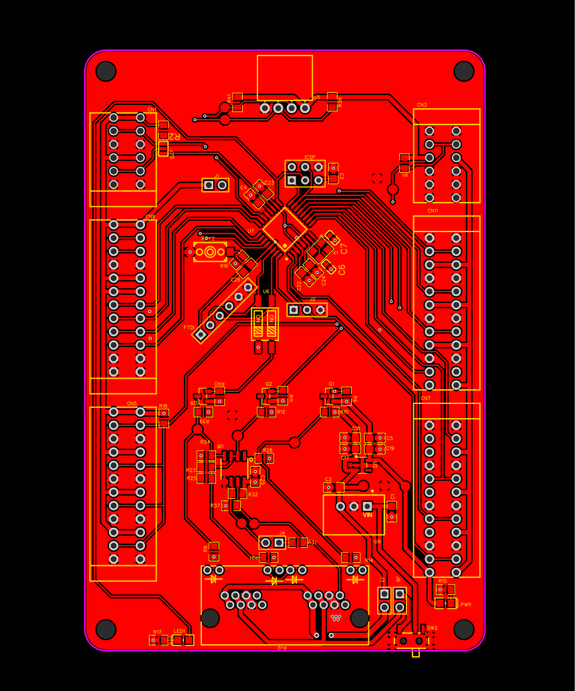
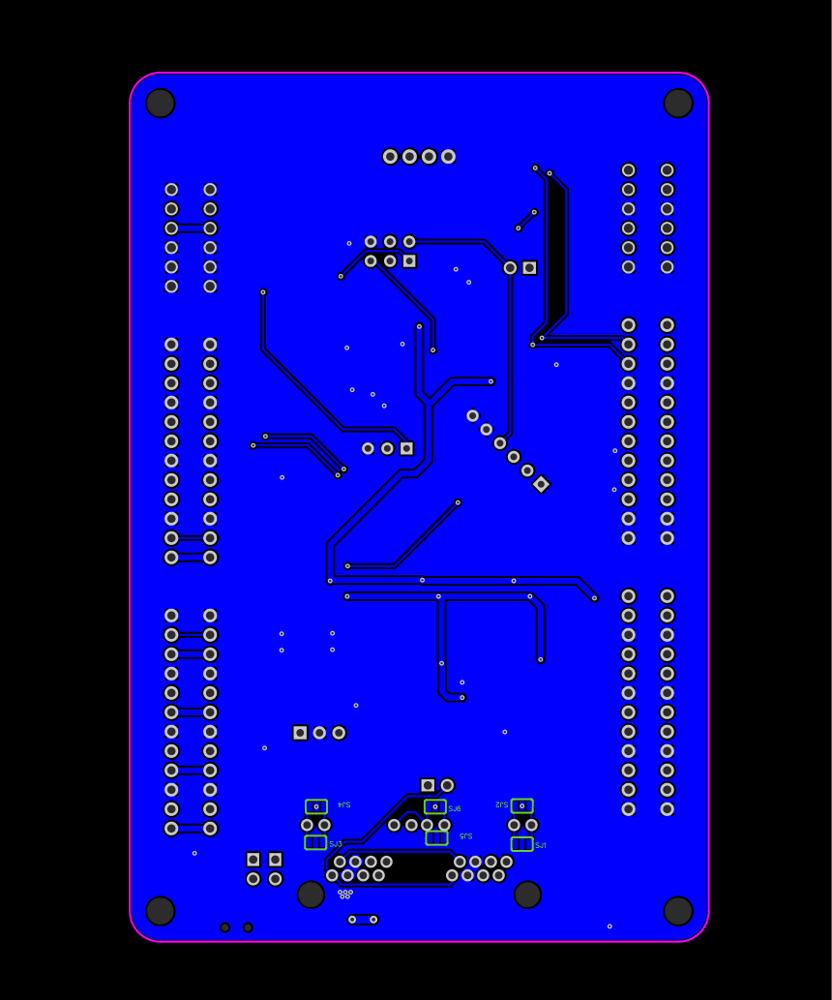

# Arduino Fan Coil Controller

This repository contains the source code for an Arduino-based Fan Coil Controller. The system integrates temperature and humidity sensors, Modbus RTU communication, and various I/O functionalities to manage a fan coil unit. Below you will find the detailed documentation for setting up and running the code.

## Hardware Requirements

- Arduino board (e.g., Uno, Mega)
- DHT22 Temperature and Humidity Sensors (x2)
- DS18B20 Temperature Sensors (x4)
- Modbus RTU Module
- OneWire Bus
- Software Serial Library
- Various digital and analog I/O components (sensors, relays, etc.)

## Library Dependencies

Ensure you have the following libraries installed in your Arduino IDE:
- `DHT.h`
- `DallasTemperature.h`
- `ModbusRTUSlave.h`
- `OneWire.h`
- `SoftwareSerial.h`
- `Wire.h`

## Pin Configuration

The following pin configuration should be adhered to for proper operation:

| Function                  | Pin            |
|---------------------------|----------------|
| DE_PIN                    | 9              |
| DS18B20_PIN               | 8              |
| DHT22_PIN_1               | 7              |
| DHT22_PIN_2               | 6              |
| ANALOG_IO_1               | A0             |
| ANALOG_IO_2               | A1             |
| ANALOG_IO_3               | A2             |
| ANALOG_IO_4               | A3             |
| ANALOG_IO_6               | A6             |
| ANALOG_IO_7               | A7             |
| DIGITAL_INPUT_1           | 3 (TX pin for SoftwareSerial) |
| DIGITAL_INPUT_2           | 4              |
| HALL_SENSOR_PIN           | 2              |
| DIGITAL_OUTPUT_1          | 5              |
| DIGITAL_OUTPUT_2          | 10             |
| DIGITAL_OUTPUT_3          | 11             |
| DIGITAL_OUTPUT_4          | 12             |

## Schematic

## PCB images

## Configuration Constants

- `SLAVE_ID`: Modbus slave ID (default: `0x01`)
- `MODBUS_SPEED`: Modbus communication speed (default: `115200` baud)

## How It Works

### Initialization

- The code initializes all pins and sensors.
- Modbus RTU is set up for communication.

### Main Loop

- The code continuously reads temperatures from the DS18B20 sensors and humidity/temperature from the DHT22 sensors.
- These readings are stored in structured variables that represent the state of the fan coil unit.
- Digital inputs and outputs are managed according to the state of the system.
- Fan speed is calculated using a hall sensor interrupt to determine RPM.

### Interrupt Service Routine

- `hallSensorInterrupt()`: Calculates RPM based on the time interval between pulses from a hall sensor.

## Usage

1. **Wiring:** Connect your sensors and modules to the Arduino according to the pin configuration table.
2. **Install Libraries:** Ensure the required libraries are installed in your Arduino IDE.
3. **Upload Code:** Compile and upload the code to your Arduino board.
4. **Run:** The system will start reading sensor data and managing the fan coil unit as per the logic defined in the code.

## Debugging

- Uncomment `#define DEBUG` to enable debugging via `SoftwareSerial` on pins 2 (RX) and 3 (TX).
- Debugging outputs will be sent to the serial monitor to help you trace issues.

## Modbus Register Map

### Holding Registers

| Address | Variable             | Type        | Options    |
|---------|----------------------|-------------|------------|
| 1       | Tubes cold IN        | `float*100` | READ ONLY  |
| 2       | Tubes hot  IN        | `float*100` | READ ONLY  |
| 3       | Tubes cold OUT       | `float*100` | READ ONLY  |
| 4       | Tubes hot  OU        | `float*100` | READ ONLY  |
| 5       | T air IN             | `float*100` | READ ONLY  |
| 6       | T air OUT            | `float*100` | READ ONLY  |
| 7       | H% air IN            | `float*100` | READ ONLY  |
| 8       | H% air OUT           | `float*100` | READ ONLY  |
| 9       | Fan Speed            | int         | READ ONLY  |
| 10      | Nodes alive          | int         | READ ONLY  |
| 11      | Mac[0]               | byte        | READ ONLY  |
| 12      | Mac[1]               | byte        | READ ONLY  |
| 13      | Mac[2]               | byte        | READ ONLY  |
| 14      | Mac[3]               | byte        | READ ONLY  |
| 15      | Mac[4]               | byte        | READ ONLY  |
| 16      | Mac[5]               | byte        | READ ONLY  |
| 17      | Temp                 | `float*100` | READ ONLY  |
| 18      | Humidity             | `float*100` | READ ONLY  |
| 19      | Pressure             | `float*100` | READ ONLY  |
| 20      | Temp                 | `float*100` | READ ONLY  |
| 21      | Humidity             | `float*100` | READ ONLY  |
| 16+6*X  | Mac[0]               | byte        | READ ONLY  |
| 16+6*X  | Mac[1]               | byte        | READ ONLY  |
| 16+6*X  | Mac[2]               | byte        | READ ONLY  |
| 16+6*X  | Mac[3]               | byte        | READ ONLY  |
| 16+6*X  | Mac[4]               | byte        | READ ONLY  |
| 16+6*X  | Mac[5]               | byte        | READ ONLY  |
| 16+6*X  | Temp                 | `float*100` | READ ONLY  |
| 16+6*X  | Humidity             | `float*100` | READ ONLY  |

### Discrete Inputs

| Address | Variable     | Type | Options   |
|---------|--------------|------|-----------|
| 0       | digitalInput1| bool | READ ONLY |
| 1       | Hall state   | bool | READ ONLY |
| 2+2*0   | Hall state   | bool | READ ONLY |
| 3+2*0   | Alive        | bool | READ ONLY |
| 2+2*1   | Hall state   | bool | READ ONLY |
| 3+2*1   | Alive        | bool | READ ONLY |
| 2+2*X   | Hall state   | bool | READ ONLY |
| 3+2*X   | Alive        | bool | READ ONLY |

### Coils

| Address | Variable       | Type | Options     |
|---------|----------------|------|-------------|
| 0       | LED_STATE      | bool | READ/WRITE  |
| 1       | digitalOutput1 | bool | READ/WRITE  |
| 2       | digitalOutput2 | bool | READ/WRITE  |
| 3       | digitalOutput3 | bool | READ/WRITE  |
| 4       | digitalOutput4 | bool | READ/WRITE  |

## Notes

- The code includes support for ESPNOW peripherals, which can be enabled by uncommenting `#define ESPNOW_PERIPH`.
- Ensure correct wiring and sensor connections to avoid erroneous readings.
- Modbus configuration and communication parameters may need adjustment based on your specific setup.

## License

This project is licensed under the MIT License.

---

